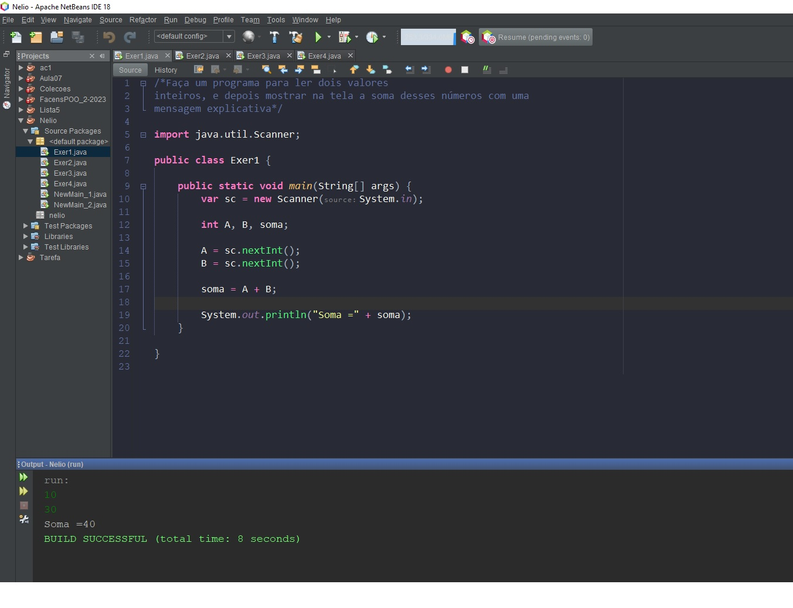
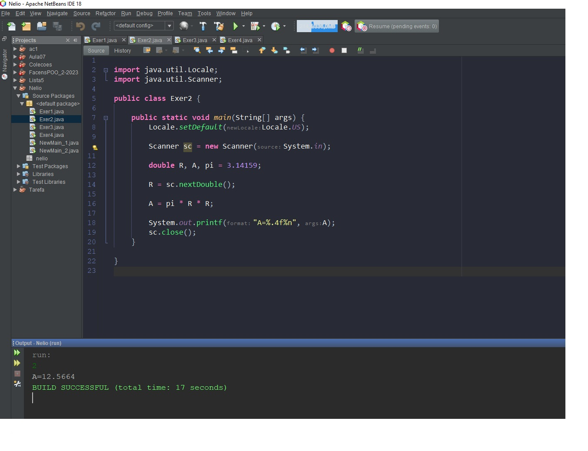
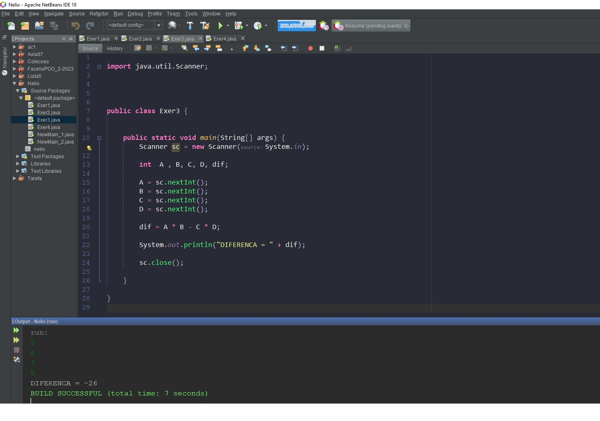
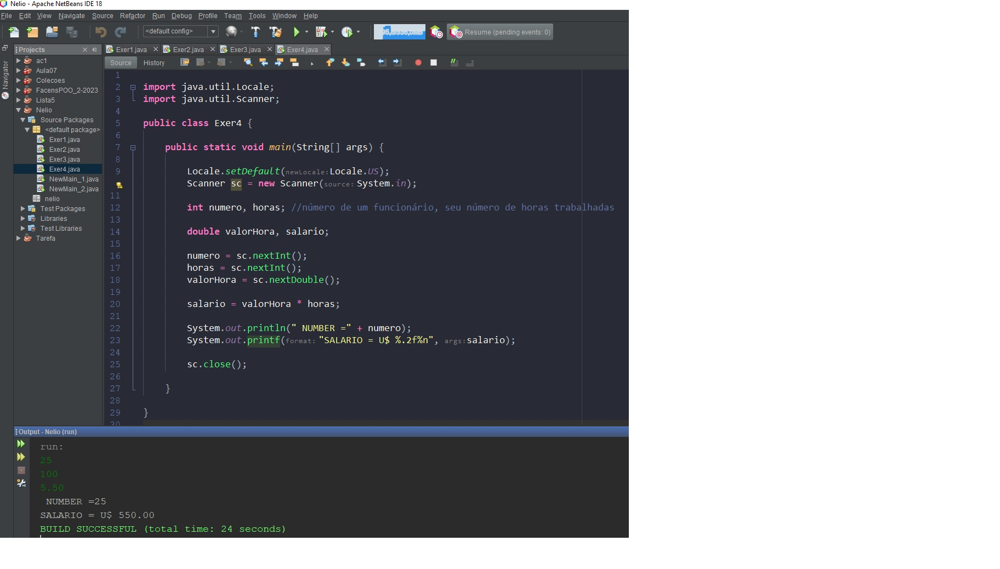

## Exercícios sobre Estrutura Sequencial (entrada, processamento, saída)

1.Exercicio:

Faça um programa para ler dois valores inteiros, e depois mostrar na tela a soma desses números com uma
mensagem explicativa

2.Exercicio:

Faça um programa para ler o valor do raio de um círculo, e depois mostrar o valor da área deste círculo com quatro
casas decimais conforme exemplos.
Fórmula da área: area = π . raio2
Considere o valor de π = 3.14159

3.Exercicio:

Fazer um programa para ler quatro valores inteiros A, B, C e D. A seguir, calcule e mostre a diferença do produto
de A e B pelo produto de C e D segundo a fórmula: DIFERENCA = (A * B - C * D).

4.Exercicio:
Fazer um programa que leia o número de um funcionário, seu número de horas trabalhadas, o valor que recebe por
hora e calcula o salário desse funcionário. A seguir, mostre o número e o salário do funcionário, com duas casas
decimais.

